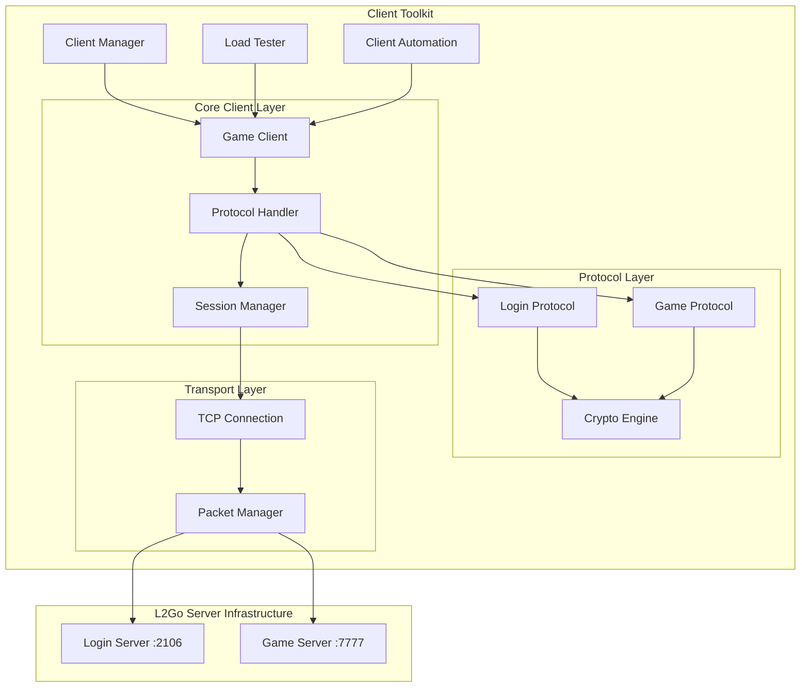

# Design Document: Game Client Toolkit

## Overview

The Game Client Toolkit is a comprehensive Go-based solution for connecting multiple clients to the existing L2Go server infrastructure. The toolkit provides a complete game client implementation, multi-client management capabilities, load testing utilities, and client automation framework. 

The design leverages the existing server protocol and encryption mechanisms, implementing both Blowfish encryption for login server communication and XOR encryption for game server communication. The toolkit is designed to be modular, scalable, and easy to use for development, testing, and load testing scenarios.

## Architecture

The toolkit follows a layered architecture with clear separation of concerns:



## Components and Interfaces

### 1. Game Client (`client/gameclient.go`)

The core client implementation that handles the complete connection lifecycle.

```go
type GameClient struct {
    ID              string
    Config          *ClientConfig
    LoginConn       *LoginConnection
    GameConn        *GameConnection
    SessionManager  *SessionManager
    State          ClientState
    EventHandlers  map[string]EventHandler
}

type ClientConfig struct {
    LoginServerHost string
    LoginServerPort int
    GameServerHost  string
    GameServerPort  int
    Username        string
    Password        string
    AutoCreate      bool
    Timeout         time.Duration
}

type ClientState int
const (
    StateDisconnected ClientState = iota
    StateConnectingLogin
    StateAuthenticating
    StateSelectingServer
    StateConnectingGame
    StateInGame
    StateError
)
```

**Key Methods:**
- `Connect() error` - Initiates full connection sequence
- `Login(username, password string) error` - Authenticates with login server
- `SelectServer(serverID int) error` - Selects game server
- `ConnectToGame() error` - Connects to game server
- `CreateCharacter(name string, template CharacterTemplate) error`
- `Disconnect() error` - Gracefully disconnects from all servers

### 2. Protocol Handler (`protocol/handler.go`)

Manages packet encoding/decoding and protocol-specific operations.

```go
type ProtocolHandler struct {
    LoginProtocol *LoginProtocol
    GameProtocol  *GameProtocol
    CryptoEngine  *CryptoEngine
}

type LoginProtocol struct {
    BlowfishKey []byte
}

type GameProtocol struct {
    XORCipher *xor.Cipher
}

type CryptoEngine struct {
    BlowfishCipher *blowfish.Cipher
    XORCipher      *xor.Cipher
}
```

**Key Methods:**
- `EncodeLoginPacket(opcode byte, data []byte) ([]byte, error)`
- `DecodeLoginPacket(raw []byte) (opcode byte, data []byte, error)`
- `EncodeGamePacket(opcode byte, data []byte) ([]byte, error)`
- `DecodeGamePacket(raw []byte) (opcode byte, data []byte, error)`

### 3. Client Manager (`manager/clientmanager.go`)

Manages multiple concurrent client connections with monitoring and control capabilities.

```go
type ClientManager struct {
    clients         map[string]*GameClient
    config          *ManagerConfig
    metrics         *ConnectionMetrics
    eventBus        *EventBus
    shutdownChan    chan struct{}
    wg              sync.WaitGroup
    mu              sync.RWMutex
}

type ManagerConfig struct {
    MaxClients      int
    ConnectInterval time.Duration
    HealthCheck     time.Duration
    RetryAttempts   int
    RetryDelay      time.Duration
}

type ConnectionMetrics struct {
    TotalConnections    int64
    ActiveConnections   int64
    FailedConnections   int64
    AverageConnectTime  time.Duration
    LastUpdateTime      time.Time
}
```

**Key Methods:**
- `CreateClients(count int, config ClientConfig) error`
- `StartClients(clientIDs []string) error`
- `StopClients(clientIDs []string) error`
- `GetMetrics() *ConnectionMetrics`
- `GetClientStatus(clientID string) (*ClientStatus, error)`

### 4. Load Tester (`testing/loadtester.go`)

Provides comprehensive load testing capabilities with configurable scenarios.

```go
type LoadTester struct {
    manager     *ClientManager
    scenarios   map[string]*TestScenario
    results     *TestResults
    config      *LoadTestConfig
}

type TestScenario struct {
    Name            string
    ClientCount     int
    Duration        time.Duration
    RampUpTime      time.Duration
    Actions         []TestAction
    Assertions      []TestAssertion
}

type TestResults struct {
    StartTime           time.Time
    EndTime             time.Time
    TotalClients        int
    SuccessfulClients   int
    FailedClients       int
    AverageResponseTime time.Duration
    ThroughputPerSecond float64
    ErrorRate           float64
    DetailedMetrics     map[string]interface{}
}
```

**Key Methods:**
- `RunScenario(scenarioName string) (*TestResults, error)`
- `CreateCustomScenario(scenario *TestScenario) error`
- `GenerateReport(results *TestResults) ([]byte, error)`

### 5. Client Automation (`automation/automation.go`)

Framework for scripting and automating client behaviors.

```go
type AutomationEngine struct {
    scripts     map[string]*Script
    scheduler   *Scheduler
    executor    *ScriptExecutor
}

type Script struct {
    Name        string
    Description string
    Actions     []Action
    Conditions  []Condition
    Variables   map[string]interface{}
}

type Action interface {
    Execute(client *GameClient, context *ExecutionContext) error
    GetType() ActionType
}

type ActionType string
const (
    ActionLogin         ActionType = "login"
    ActionCreateChar    ActionType = "create_character"
    ActionSelectChar    ActionType = "select_character"
    ActionWait          ActionType = "wait"
    ActionCustom        ActionType = "custom"
)
```

## Data Models

### Connection Models

```go
type LoginConnection struct {
    conn        net.Conn
    sessionID   []byte
    protocol    *LoginProtocol
    isConnected bool
}

type GameConnection struct {
    conn        net.Conn
    protocol    *GameProtocol
    isConnected bool
}

type SessionManager struct {
    loginSession  *LoginSession
    gameSession   *GameSession
}

type LoginSession struct {
    SessionID     []byte
    AccountInfo   *AccountInfo
    ServerList    []ServerInfo
    SelectedServer *ServerInfo
}

type GameSession struct {
    Characters    []CharacterInfo
    SelectedChar  *CharacterInfo
    GameState     *GameState
}
```

### Packet Models

```go
type Packet struct {
    Opcode    byte
    Data      []byte
    Length    uint16
    Timestamp time.Time
}

type LoginPackets struct {
    RequestAuthLogin  *RequestAuthLoginPacket
    RequestServerList *RequestServerListPacket
    RequestPlay       *RequestPlayPacket
}

type GamePackets struct {
    ProtocolVersion  *ProtocolVersionPacket
    CharacterCreate  *CharacterCreatePacket
    CharacterSelect  *CharacterSelectPacket
}

type CharacterTemplate struct {
    Race     int
    Class    int
    Gender   int
    HairStyle int
    HairColor int
    Face     int
}

type CharacterInfo struct {
    Name      string
    Level     int
    Class     int
    Race      int
    Gender    int
    Location  *Location
    Stats     *CharacterStats
}
```

## Correctness Properties

*A property is a characteristic or behavior that should hold true across all valid executions of a system—essentially, a formal statement about what the system should do. Properties serve as the bridge between human-readable specifications and machine-verifiable correctness guarantees.*

### Property 1: TCP Connection Establishment
*For any* valid server configuration (host and port), the Game_Client should successfully establish a TCP connection when the server is available
**Validates: Requirements 1.1, 1.5**

### Property 2: Blowfish Encryption Round-trip
*For any* valid login packet data, encrypting with Blowfish then decrypting should produce the original data
**Validates: Requirements 1.2, 1.3, 3.1**

### Property 3: XOR Encryption Round-trip  
*For any* valid game packet data and XOR key, encrypting then decrypting should produce the original data
**Validates: Requirements 1.7, 3.2**

### Property 4: Protocol Version Response
*For any* protocol version request from the game server, the Game_Client should respond with protocol version 419
**Validates: Requirements 1.6**

### Property 5: Encryption Context Isolation
*For any* simultaneous login and game connections, modifications to one encryption context should not affect the other
**Validates: Requirements 1.8**

### Property 6: Client Manager Capacity Limits
*For any* specified client limit, the Client_Manager should never create more concurrent clients than the limit allows
**Validates: Requirements 2.2**

### Property 7: Client Manager Resource Cleanup
*For any* client disconnection or shutdown, all associated resources should be properly cleaned up and connection counts updated
**Validates: Requirements 2.3, 2.6**

### Property 8: Client Manager Failure Isolation
*For any* client connection failure, other active clients should remain unaffected and continue operating normally
**Validates: Requirements 2.5**

### Property 9: Binary Data Encoding Round-trip
*For any* valid data structure, encoding to binary format then decoding should produce an equivalent structure
**Validates: Requirements 3.3, 3.4**

### Property 10: Packet Type Support Completeness
*For any* essential packet type (login, game, character operations), the Protocol_Handler should successfully encode and decode the packet
**Validates: Requirements 3.5, 3.6**

### Property 11: Character Management Workflow
*For any* character operation (create, select, list), the Game_Client should send appropriate packets and correctly parse server responses
**Validates: Requirements 4.1, 4.2, 4.3, 4.4**

### Property 12: Character Information Persistence
*For any* character data received during a session, the information should be stored locally and remain accessible throughout the session
**Validates: Requirements 4.5**

### Property 13: Load Test Client Creation
*For any* specified client count in a load test, the Load_Tester should create exactly that number of concurrent connections
**Validates: Requirements 5.1**

### Property 14: Load Test Metrics Collection
*For any* load test execution, comprehensive performance metrics should be collected and available for reporting
**Validates: Requirements 5.2, 5.3**

### Property 15: Load Test Error Resilience
*For any* errors occurring during load testing, the Load_Tester should log the errors and continue testing with remaining clients
**Validates: Requirements 5.4**

### Property 16: Automation Script Execution
*For any* valid automation script, the Client_Automation should execute all actions in sequence with configured timing
**Validates: Requirements 6.1, 6.2**

### Property 17: Automation Error Handling
*For any* script execution error, the Client_Automation should handle the failure gracefully and continue with remaining actions
**Validates: Requirements 6.3**

### Property 18: Configuration File Processing
*For any* valid configuration file, the Game_Client should correctly read and apply all server addresses, ports, and authentication settings
**Validates: Requirements 7.1, 7.2**

### Property 19: Configuration Validation
*For any* invalid configuration parameters, the system should provide clear, helpful error messages indicating the specific validation failures
**Validates: Requirements 7.5**

### Property 20: Comprehensive Logging
*For any* system event (connections, packet exchanges, errors), appropriate log entries should be created with correct timestamps and detail levels
**Validates: Requirements 8.1, 8.2, 8.3**

### Property 21: Log Level Filtering
*For any* configured log level, only messages at that level or higher should appear in the output
**Validates: Requirements 8.4**

## Error Handling

The toolkit implements comprehensive error handling across all layers:

### Connection Errors
- **Network failures**: Automatic retry with exponential backoff
- **Timeout handling**: Configurable timeouts for all network operations
- **Server unavailability**: Graceful degradation and user notification
- **Protocol mismatches**: Clear error messages with version information

### Authentication Errors
- **Invalid credentials**: Specific error codes and messages
- **Account creation failures**: Detailed validation error reporting
- **Session expiration**: Automatic re-authentication when possible
- **Server rejection**: Proper error propagation to calling code

### Encryption Errors
- **Key initialization failures**: Fallback mechanisms and error reporting
- **Decryption failures**: Packet validation and error recovery
- **Checksum mismatches**: Packet retransmission and connection validation
- **Cipher state corruption**: Automatic cipher re-initialization

### Resource Management Errors
- **Memory allocation failures**: Graceful degradation and cleanup
- **File I/O errors**: Proper error handling for configuration and logs
- **Concurrent access issues**: Thread-safe operations with proper locking
- **Resource leaks**: Automatic cleanup with defer statements and finalizers

### Testing and Automation Errors
- **Script execution failures**: Error isolation and continuation strategies
- **Load test failures**: Partial result preservation and error analysis
- **Configuration errors**: Validation and helpful error messages
- **Metric collection failures**: Fallback mechanisms and data integrity

## Testing Strategy

The testing strategy employs a dual approach combining unit tests for specific scenarios and property-based tests for comprehensive validation:

### Unit Testing Approach
- **Specific examples**: Test concrete scenarios with known inputs and expected outputs
- **Edge cases**: Test boundary conditions, empty inputs, and error conditions
- **Integration points**: Test component interactions and data flow
- **Mock dependencies**: Use mocks for external services (servers, network)
- **Error conditions**: Test all error paths and recovery mechanisms

### Property-Based Testing Approach
- **Universal properties**: Test properties that should hold for all valid inputs
- **Randomized inputs**: Generate diverse test data to uncover edge cases
- **Encryption round-trips**: Verify encrypt/decrypt operations preserve data
- **Protocol compliance**: Ensure packet encoding/decoding maintains integrity
- **Concurrency safety**: Test thread-safe operations under concurrent access
- **Resource management**: Verify proper cleanup and resource handling

### Testing Framework Configuration
- **Property test library**: Use `gopter` for property-based testing in Go
- **Test iterations**: Minimum 100 iterations per property test for thorough coverage
- **Test tagging**: Each property test tagged with format: **Feature: game-client-toolkit, Property {number}: {property_text}**
- **Parallel execution**: Run tests concurrently where safe to reduce execution time
- **Test data generation**: Smart generators that produce valid, diverse test inputs

### Test Categories

#### Protocol Tests
- Unit tests for specific packet types and known server responses
- Property tests for encryption/decryption round-trips
- Property tests for packet encoding/decoding integrity
- Integration tests for complete protocol workflows

#### Client Management Tests  
- Unit tests for specific client lifecycle scenarios
- Property tests for concurrent client creation and management
- Property tests for resource cleanup and connection limits
- Load tests for scalability and performance validation

#### Automation Tests
- Unit tests for specific script execution scenarios
- Property tests for script parameterization and execution
- Property tests for error handling and recovery
- Integration tests for complete automation workflows

#### Configuration Tests
- Unit tests for specific configuration scenarios
- Property tests for configuration validation and error handling
- Property tests for environment-specific configuration profiles
- Integration tests for configuration loading and application

### Test Environment Setup
- **Mock servers**: Implement mock L2Go servers for isolated testing
- **Test databases**: Use in-memory or containerized databases for testing
- **Network simulation**: Simulate network conditions (latency, packet loss)
- **Concurrent testing**: Test infrastructure for multi-client scenarios
- **Performance monitoring**: Collect metrics during test execution

### Continuous Integration
- **Automated test execution**: Run all tests on code changes
- **Performance regression detection**: Monitor test execution times
- **Coverage reporting**: Maintain high test coverage across all components
- **Property test result analysis**: Track property test failures and patterns
- **Integration with existing L2Go server tests**: Ensure compatibility